# Memory : SAÉ S2.01
### Développement d'application avec interface homme-machine
> HTML · CSS · JavaScript

---

## L'équipe

| Membre | Rôle |
|---|---|
| **Amira Karmadi** | Formulaire, liaison serveur, design (`index.html`, `app.js`, `ApiService.js`, `style.css`) |
| **Nathan Fivel** | Affichage, chronomètre et optimisation (`DOMManager.js`, `Timer.js`) |
| **Tiago Joaquim** | Logique de jeu, maintenance (`DOMManager.js`, `Game.js`,`style.css`) |

---

## Le projet

Un jeu de Memory développé en JavaScript dans le cadre de la SAÉ S2.01. Le joueur choisit son pseudo, une difficulté et une collection d'images, puis doit retrouver toutes les paires de cartes avant la fin du chronomètre. Les scores sont envoyés à un serveur distant à la fin de chaque partie.

---

## Pourquoi ce thème ?

On a choisi un univers **céleste et vaporeux** ; dégradés pastel, effets de verre, animations douces : parce qu'il entre en résonance avec l'idée même du Memory.

La mémoire, c'est quelque chose d'immatériel et de flottant. Les souvenirs se superposent, s'effacent, réapparaissent. On voulait que l'interface reflète ça : quelque chose entre le rêve et le réel, où chaque carte retournée est comme un fragment de souvenir qu'on cherche à retrouver.

Le ciel, les nuages, la lumière diffuse ; c'est l'espace mental dans lequel on fouille quand on essaie de se rappeler.

---

## Ce qu'on a apprécié

**Amira** a particulièrement aimé donner une vraie identité au projet : écrire l'histoire de la page d'accueil, choisir les couleurs, les polices, les animations, faire en sorte que le jeu raconte quelque chose avant même qu'on appuie sur "Jouer". Transformer un exercice technique en quelque chose qui a un sens et une âme, c'était la partie la plus fun.

**Nathan** a apprécié le travail sur le chronomètre et l'optimisation de `Game.js`; s'assurer que la logique tienne la route. Voir les performances s'améliorer et le comportement du jeu devenir prévisible, c'était satisfaisant.

**Tiago** a adoré ajouter les sons et observer le jeu évoluer coup par coup. Entendre un petit effet sonore au retournement d'une carte ou à la découverte d'une paire, ça change tout à l'immersion. Voir la logique prendre vie en temps réel, c'était clairement le moment le plus satisfaisant du projet.

---

## Nos difficultés

Le plus challengeant pour tout le monde a été **`DOMManager.js`** et **`Game.js`**.

`DOMManager` demandait de bien comprendre comment le JavaScript interagit avec le HTML en temps réel ; gérer les états des cartes, l'affichage conditionnel des vues, les événements au clic, sans jamais mélanger la logique d'affichage avec la logique métier. La frontière est fine et on l'a franchie plus d'une fois.

`Game.js` était le coeur du projet : orchestrer le mélange des cartes, la comparaison des paires, le verrouillage pendant la vérification, le chronomètre et la fin de partie, tout en gardant un code lisible. La gestion des champs privés et des callbacks asynchrones nous a bien donné du fil à retordre.

---

## Fonctionnalités

### Minimum attendu
- Formulaire d'accueil avec pseudo, difficulté et collection d'images
- Plateau de jeu avec cartes face cachée et effet de retournement
- Détection des paires et fin de partie
- Chronomètre compte à rebours et envoi du score au serveur

### Fonctionnalités bonus
- Compteur de coups en temps réel
- Écran de fin avec récapitulatif (temps, coups, bouton rejouer)
- Confettis animés en cas de victoire, avec effet sonnore
- Flash rouge en cas de défaite ou d'abandon, avec effet sonnore
- Sons au retournement de carte et à la découverte d'une paire
- Collections d'images supplémentaires
- Système de combos (enchaînement de paires : multiplicateur x2, x3… avec son progressif)
- Mode "Memory Inversé" : associer des paires liées par une logique (clé/serrure, soleil/lune…) plutôt que des images identiques

---

## Collections d'images disponibles

- Animaux
  

    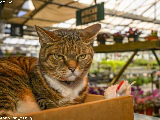
    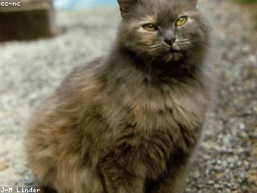
    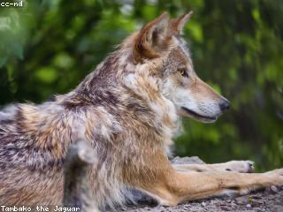
    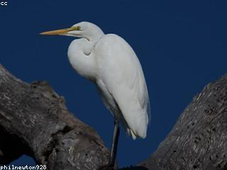
    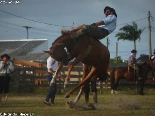
    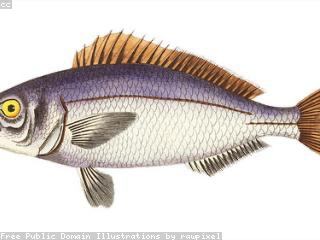
    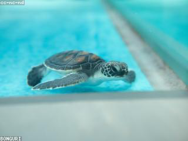
    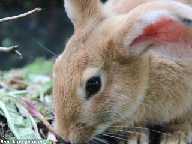
  

- Fruits
  

    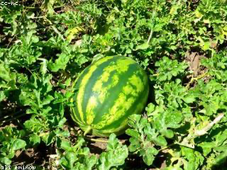
    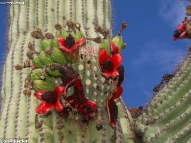
    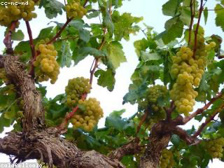
    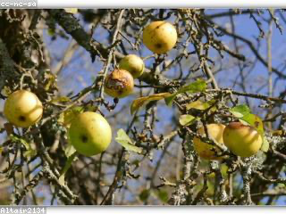
    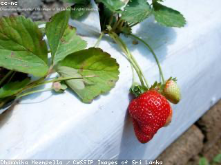
    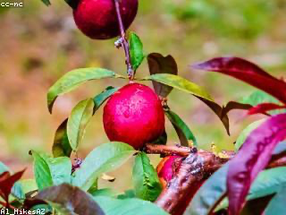
    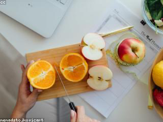
    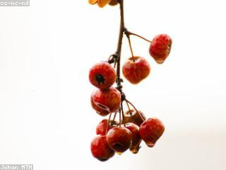
  

- Voitures
  

    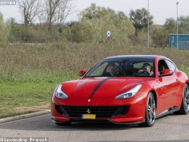
    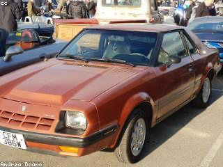
    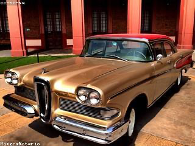
    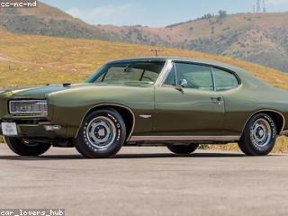
    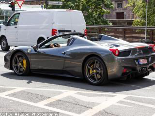
    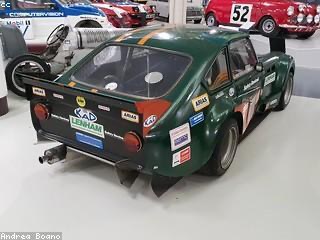
    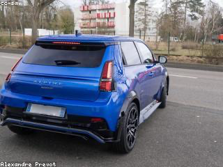
    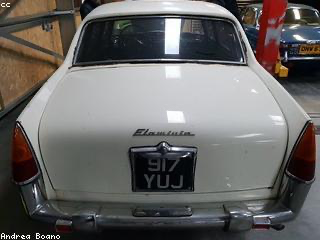
  

- Mario Party
  

    
    
    
    
    
    
    
    
  

- Studio Ghibli
  

    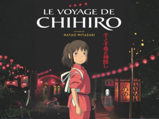
    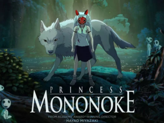
    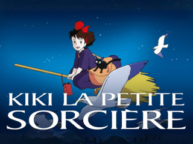
    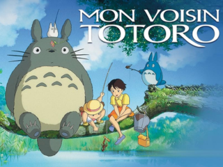
    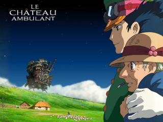
    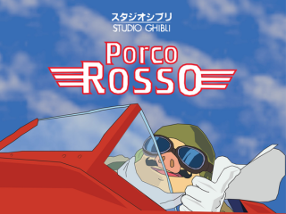
    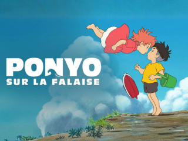
    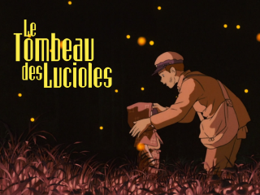
  

- Walt Disney
  

    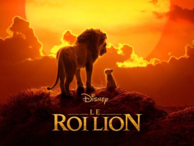
    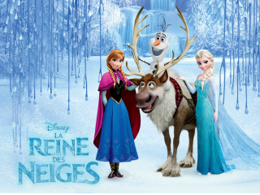
    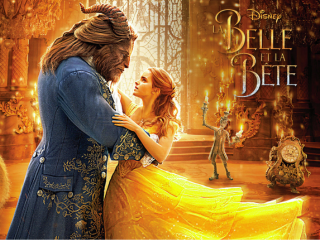
    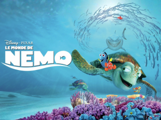
    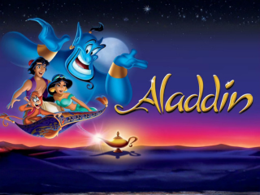
    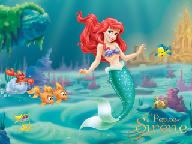
    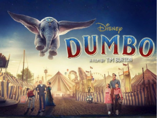
    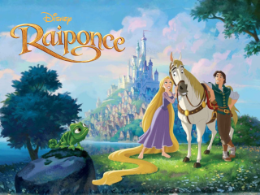
  

- BDE 24-25
  

    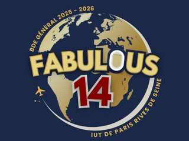
    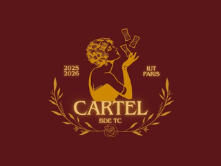
    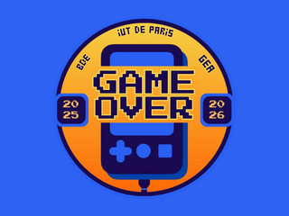
    
    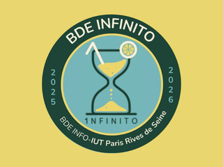
    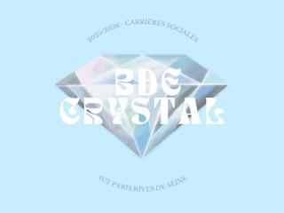
    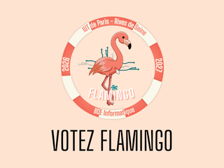
    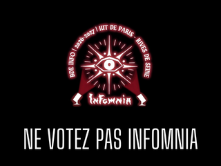
  

- Pokémon
  

    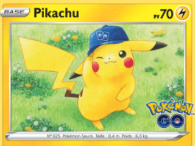
    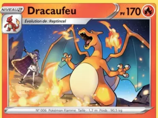
    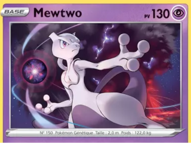
    
    
    
    
    
  

- Youtubeurs Français
  

    
    
    
    
    
    
    
    
  

- Albums Intergenerationel
  

    
    
    
    
    
    
    
    
  

- Albums en vogue actuellement
  

    
    
    
    
    
    
    
    
  

- Marques connues
  

    
    
    
    
    
    
    
    
  

- Genshin Impact
  

    
    
    
    
    
    
    
    
  

- Personnes marquantes
  

    
    
    
    
    
    
    
    
  

- Mode Memory Inversé
  

    
    
    
    
    
    
    
    
  

  

    
    
    
    
    
    
    
    
  

---

## Suivi d'avancement

| Tâche | Statut   |
|---|----------|
| Formulaire d'accueil | Terminé  |
| Affichage des cartes | Terminé  |
| Logique de jeu | Terminé  |
| Chronomètre | Terminé  |
| Liaison serveur | Terminé  |
| Compteur de coups | Terminé  |
| Écran de fin | Terminé  |
| Animations victoire / défaite | Terminé  |
| Sons | Terminé  |
| Collections d'images supplémentaires | En cours |
| Système de combos | Terminé  |
| Mode Memory Inversé | En cours |
